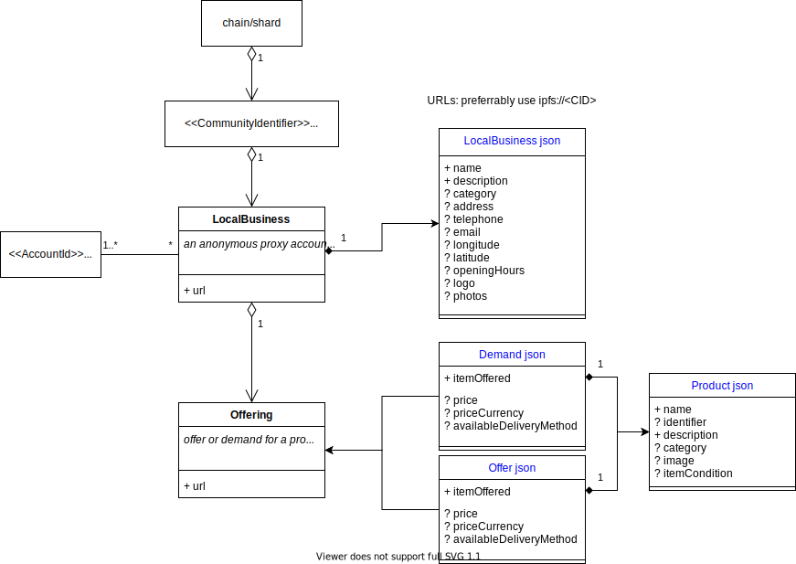

# Encointer Bazaar

## design draft

this is a design document WIP and does not necessarily reflect the current implementation



### scope

The encointer bazaar shall 

* follow the [GoodRelations](http://wiki.goodrelations-vocabulary.org/Documentation) vocabulary for e-commerce where possible
* be compatible with schema.org json
  * [LocalBusiness](https://schema.org/LocalBusiness) many shops may already have prepared this for google maps anyway
  * [Product](https://schema.org/Product) Any offered product or service. For example: a pair of shoes; a concert ticket; the rental of a car; a haircut; or an episode of a TV show streamed online.
  * [Offer](https://schema.org/Offer) / [Demand](https://schema.org/Demand) with a price and delivery method

### custom rpc methods

For good API performance and dev experience, encointer nodes shall offer handy queries for bazaar. Usually, queries only concern one community

#### `bazaar_getMyLocalBusinesses(who: AccountId)`

returns: `JsonArray<local_business: AccountId>`

get all businesses controlled by *who*. Needs to iterate through all proxy accounts to see which ones delegate to *who*

#### `bazaar_getLocalBusinesses(cid: CommunityIdentifier)`

returns: `JsonArray<(local_business: AccountId, json: url)>`

get all business accounts for a specific community with their metadata url

#### `bazaar_getOfferings(cid: CommunityIdentifier, local_business?: AccountId, since?: BlockNumber)`

returns: `JsonArray<(offering: url)>`

optional:
* local_business: only query offerings for that business
* since: allows to filter by updated block height to query fresh entries only


### storage

```
BusinessRegistry: double_map(cid, AccountId) -> (url, block_number)
OfferingRegistry: double_map(cid, AccountId) -> Vec<(url, block_number)>
```

#### performance considerations

complexity `Vec` vs `map` for sets:

|operation| `vec` | `map` |
|----|----|-----|
|membership check | DB Reads: O(1) Decoding: O(n) Search: O(log n) | DB Reads: O(1) |
|update | DB Writes: O(1) Encoding: O(n) |DB Reads: O(1) Encoding: O(1) DB Writes: O(1) |
| iterate| DB Reads: O(1) Decoding: O(n) Processing: O(n)|DB Reads: O(n) Decoding: O(n) Processing: O(n) |

iteration complexity (where vec would be better) is irrelevant because the bazaar pallet doesn't iterate

obviously, `map` scales better in terms of dispatchable `weight` for large `n` with no disadvantage for large number of calls with small `n`. Moreover, `weight` is constant, irrespective of `n`

the mobile app or web interface will usually fetch the entire set for a given `cid`, therefore `Vec` would be lighter to use. However, if we add a custom rpc api to fetch these sets, we can offer a convenient API while only putting a little more load on the API node
